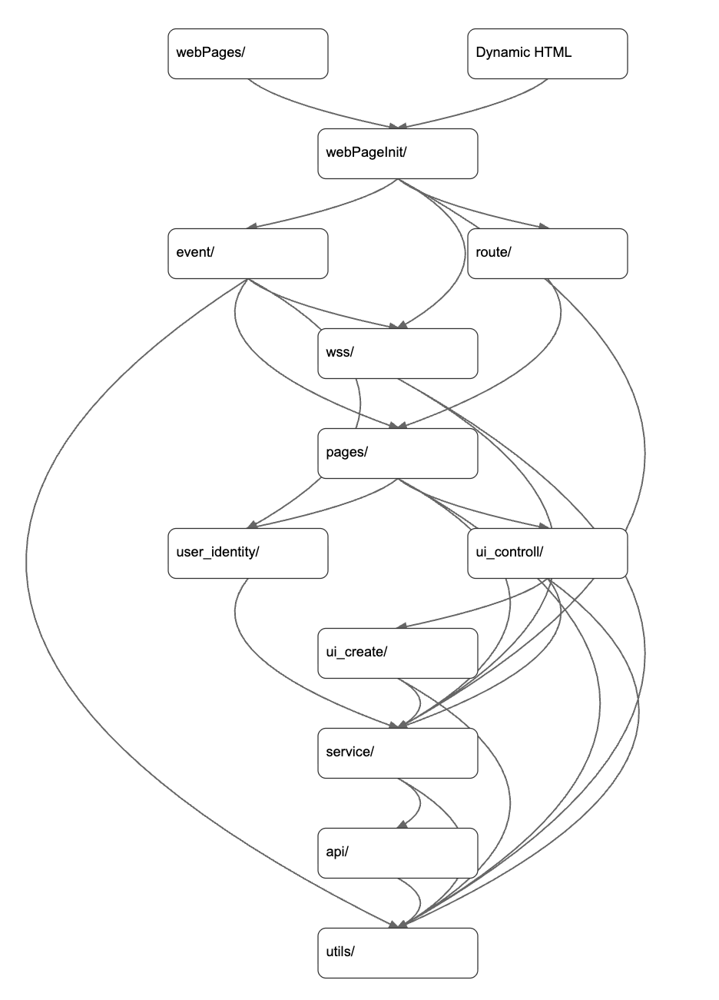
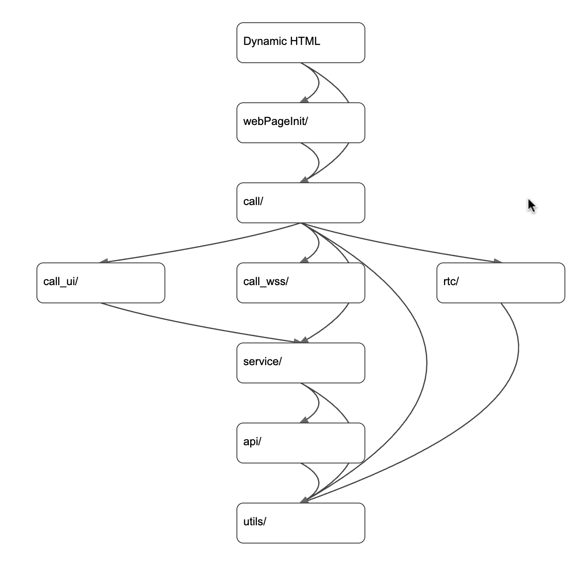
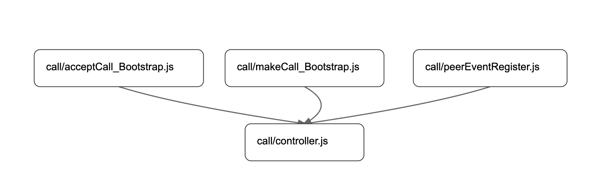

# Front-End System Overview

## 1. Introduction

Serendilang is a language exchange social platform that supports real-time video calls, text-based chat, post creation, likes, and friend connections.  
Any user on the platform can initiate a call with another user, which introduces additional security and safety considerations at the system design level.

At present, Serendilang is implemented as a web-based application.  
The system is designed with extensibility in mind and can be further extended to mobile applications in the future.

---

### 1.1 Platform Overview and Design Considerations

Due to the open nature of user-to-user communication, Serendilang incorporates reporting and blocking mechanisms for end users, as well as administrative controls that allow moderators to ban users or remove posts that violate community guidelines.

These requirements increase functional complexity in areas such as real-time communication, event handling, and state consistency, without fundamentally altering the underlying system architecture.

---

### 1.2 System Complexity and Architectural Challenges

The front-end system of Serendilang currently consists of approximately 20,000 lines of source code, reflecting the complexity of its real-time communication features, event-driven architecture, and user-facing interactions.

Designing, maintaining, and preserving the scalability of such a system requires careful attention to system-level architecture, including clear separation of responsibilities, predictable execution flow, and long-term maintainability under continuous feature evolution.

---

### 1.3 Architectural Approach and Design Rationale

To address these challenges, the front-end system is built using a multi-layer, self-defined architectural framework based on **HTML, JavaScript, and TailwindCSS**.

The multi-layer design assigns each layer a clearly defined category of responsibility, with strict dependency rules: each layer may only depend on layers beneath it.  
This structure enforces a unidirectional flow of control and prevents implicit coupling across abstraction boundaries.

In this design, application state and state transition logic are owned by higher-level layers, independent of any specific rendering or execution technology. 
Lower layers are responsible for interpreting state-derived intents and carrying out concrete execution tasks, including UI rendering, DOM mutation, and interactions with external data APIs.

The front-end system described in this document is implemented without reliance on external front-end frameworks or framework-like runtimes.

As a result, the mapping from state changes to observable effects is explicitly defined by the system, rather than implicitly handled by a framework- or framework-like managed runtime.

Importantly, the absence of a framework or framework-like dependency in this system does not preclude the future adoption of frameworks or framework-like solutions.

Because application state and state transition logic reside in higher architectural layers, the responsibility for interpreting state and producing UI behavior is isolated within dedicated UI control and UI creation layers.

As a result, the mechanism responsible for transforming state into concrete UI can be replaced without affecting the overall system design. 
In particular, the system can be adapted to a `React-based` web implementation by delegating the responsibilities currently handled by the UI control and UI creation layers to React’s rendering pipeline.

Similarly, the same architectural approach can be adapted to a mobile application implemented using `React Native` by integrating a native rendering backend. 

While developing a mobile application inherently differs from building a web application, requiring certain adjustments at higher architectural levels, these changes remain limited in scope. 
The overall design philosophy—particularly the separation of state ownership, control flow, and execution responsibilities—remains consistent across platforms, even though specific structural details may vary to accommodate platform-specific interaction models, application lifecycles, and execution environments.

---

### Notes on Implementation Fidelity

While the architecture described in this document reflects the overall structure and design principles of the system, a small number of implementation details may not strictly follow the documented design due to iterative development.

These deviations are limited in scope and can be easily refactored to fully align with the system architecture when needed.

In addition, there are a few areas where the current implementation diverges more significantly from the intended design.  
These cases have been identified as targets for future refactoring and are expected to be addressable without major structural changes.

Overall, the system remains well-aligned with the documented architecture, and the identified deviations represent manageable, incremental improvements rather than fundamental design issues.

---

## 2. Modeling and Structure

In this document, the front-end (i.e., the overall front-end codebase) is modeled as a collection of code units that are delivered from the server and executed by the browser at runtime.
A front-end code unit (hereafter referred to as a code unit) is defined as a piece of code that is delivered from the server and executed by the browser as a single file at runtime.

To support this perspective, the architecture diagrams use the following conventions.

### Diagram Conventions 

In the architecture diagrams below, each node represents a collection of code that forms a subset of the overall front-end codebase.

#### Node Naming

- A node named with a trailing `/` (e.g., `example/`) represents the collection of all files contained in a directory that physically exists on the server.  
  This directory is exposed to the frontend via server-side static asset delivery (e.g., through an Express-based static serving mechanism).  
  The browser can directly download resources from this directory at runtime.

- A node named with a file extension (e.g., `example.js` or `folder/example.js`) represents a collection consisting of a single source file that physically exists on the server.  
  This file is served to the frontend as a static asset and is downloaded and executed by the browser as an individual front-end code unit.

- A node without a file extension and without a trailing slash represents a collection of dynamically generated code units.  
  Such nodes do not correspond to a physical file or directory on the server. Instead, they represent code that is generated dynamically by server and delivered to the browser as part of a response.

Throughout the diagrams in this document, nodes sharing the same name are defined to represent the same collection of code units.

#### Edges

Edges in the diagram represent dependency relationships between code collections.  
If a code unit in node A depends on a code unit in node B during browser execution, an edge is drawn from node A to node B.

### Structural Overview

Based on this modeling approach, the front-end system is composed of two major structural parts:

- **Main Structure**
- **Call Structure**

The **Main Structure** is responsible for the core functionality of the application, including page navigation, UI rendering, event handling, data flow, and user interaction logic.  
It covers most user-facing features such as posts, chat rooms, profiles, and general UI state management.

The **Call Structure** is dedicated to real-time voice and video communication.  
It encapsulates call-related logic such as call state management, signaling, media handling, and real-time synchronization, and is designed to operate independently from the main UI flow while still integrating with the overall event-driven system.

By separating the front-end into these two structures, the system maintains clear responsibility boundaries while remaining flexible enough to support real-time communication features without overloading the main application logic.

---

## 3. Main Structure

### 3.1 Main Structure — Introduction

The main structure of the front-end is depicted in the graph below:

The diagram follows the conventions described in Section 2.

---

### 3.2 Main Structure — Layer Overview

The main structure of the front-end architecture is organized into ten layers with clearly defined responsibilities.  
This layered design serves as the backbone of the system, providing modularity, predictable dependency flow, and long-term maintainability.

---

### 3.2.1 Main Structure — Layer 1: Web Pages

**Folder:** `webPages/`

This folder contains raw `.html` files that are directly accessible to users.

**Dynamic HTML**

In some cases, when a user visits a web page, the HTML returned by the backend is dynamically generated at runtime rather than served as a static file.  
Such HTML responses are collectively referred to as **Dynamic HTML**.
All dynamically generated HTML is carefully processed and sanitized to prevent injection attacks (e.g., XSS), ensuring that only validated and escaped content is rendered to the client.
 

---

### 3.2.2 Main Structure — Layer 2: Web Page Initialization

**Folder:** `webPageInit/`

This layer contains `.js` files responsible for initializing:

- initial UI state  
- event logic  
- WebSocket connections for real-time communication  

Every webpage loads its corresponding initializer from this layer.

---

### 3.2.3 Main Structure — Layer 3: Event and Routing System

Layer 3 contains two folders: **`event/`** and **`route/`**.  

This layer acts as the **control layer** of the entire front-end architecture.

---

**`event/` Folder**

The entire front-end system is built as an event-driven system.  
Any meaningful event — such as a user pressing the send button or an incoming call from another user — whether triggered by user input or by server-side updates, flows through this folder.

Its responsibilities include:

- provide functions for registering event handlers
- dispatching events through the global event bus (`utils/eventBus.js`, Layer 10)

---

**`eventEmitter.js`**

This file attaches a global event listener to the entire document.

Every UI component that can trigger an event includes a `dataset.actionList` property—an array of action objects describing:

- the action type  
- the event name  
- optional parameters  

When a user interacts with the page (click, scroll, input, etc.), the listener reads `actionList` and emits appropriate events through the event bus.

This creates a **declarative UI model** where components specify *what event should occur*, without knowing how it will be handled.

---

**`handlers/` Subfolder**

This subfolder contains all event handling modules.

Each handler:

1. imports the event bus  
2. registers callbacks for specific event names via the event bus (`utils/eventBus.js`, Layer 10)

This design keeps event emission and event handling cleanly separated.

---

**`route/` Folder**

for the main web page, there are a menu and pages, when user touches a menu button, the main screen switch to the page that it refers.
In this folder, it defines id of each page and the logics of entering and leaving a page.

---

### 3.2.4 Main Structure — Layer 4: WebSocket system

This layer contains one folder:

- `wss/`

Serendilang is a real-time communication system. Users can exchange messages, send friend requests, receive notifications, and initiate voice or video calls.  
To support this, the UI must react to server-side events immediately and consistently across all active tabs.

The responsibility of this layer is to construct and manage the application's WebSocket object.  
All low-level WebSocket actions—such as connecting, sending messages, and handling incoming events—are defined within this layer.

---

**WebSocket Design Overview**

The WebSocket system implements a **shared connection architecture** to minimize unnecessary WebSocket connections to the server.

When a WebSocket object is created, it performs the following steps:

1. **Leader Detection**  
   - It checks `localStorage` and `BroadcastChannel` to determine if another tab has already established a WebSocket connection.  
   - If no active leader exists, the new object becomes the *leader* and opens the WebSocket connection to the server.

2. **Follower Mode**  
   - If a leader WebSocket object already exists, the new instance enters *follower mode*, meaning:
     - It does **not** open a WebSocket connection to the server.
     - It communicates with the leader through a `BroadcastChannel`.
     - The leader relays all messages to and from the server on behalf of all follower tabs.

3. **Message Routing**  
   - Messages produced by the application (e.g., sending chat messages, accepting friend requests, initiating calls) are dispatched through this layer’s WebSocket object.
   - In leader mode: messages are sent directly to the server.
   - In follower mode: messages are broadcast to the leader tab for forwarding.

4. **Server Event Distribution**  
   - When the server pushes an event over WebSocket, the leader broadcasts it to all follower instances using the same channel.
   - This ensures that every tab stays synchronized in real time.

---

**Implementation Structure**

The `wss/` folder contains three core modules, each responsible for a specific aspect of the shared WebSocket system:

- **`wssCenter.js`**  
  Serves as the central manager of the entire WebSocket system.

  This module maintains the global WebSocket abstraction, referred to as the *Virtual WSS*.  
  The Virtual WSS is not a native `WebSocket` instance created via `new WebSocket(url)`. Instead, it represents a unified logical WebSocket interface that may internally operate in either leader or follower mode.

  The Virtual WSS object is stored as a global variable within this module.  
  `wssCenter.js` is responsible for initializing the Virtual WSS, resetting or reinitializing it when necessary, and providing accessor functions to retrieve the current active instance.

  By centralizing WebSocket lifecycle management and global state in this module, the system ensures consistent behavior across all tabs while avoiding redundant WebSocket connections.

- **`createVirtualWss.js`**  
  Responsible for constructing the Virtual WebSocket abstraction (*Virtual WSS*).

  This module exposes the `createVirtualWss` factory function, which creates a unified WebSocket-like interface shared across browser tabs.  
  The returned object behaves similarly to a native `WebSocket` instance from the perspective of upper layers, while internally coordinating leader–follower roles and inter-tab communication.

  Upon creation, each Virtual WSS instance:
  - Generates a unique tab identifier.
  - Initializes a `BroadcastChannel` for cross-tab communication.
  - Checks persisted heartbeat information in `localStorage` to determine whether an existing leader is active.

  The module implements a **leader election mechanism** based on:
  - Periodic heartbeats stored in `localStorage`.
  - Cross-tab signaling via `BroadcastChannel`.
  - A lightweight lock mechanism to avoid race conditions during leader takeover.

  When operating in **leader mode**, the Virtual WSS:
  - Creates and maintains the real native `WebSocket` connection to the server.
  - Forwards incoming server messages to all follower tabs via `BroadcastChannel`.
  - Periodically emits heartbeat signals to indicate liveness.

  When operating in **follower mode**, the Virtual WSS:
  - Does not create a native `WebSocket` connection.
  - Relays outgoing messages to the leader via `BroadcastChannel`.
  - Receives server events indirectly from the leader and exposes them through the same WebSocket-like interface.

  This module also integrates with the event-driven system by emitting system-level events (e.g., WebSocket disconnection or leader failure) through the global event bus, allowing higher layers to react appropriately.

  By encapsulating leader election, heartbeat monitoring, and inter-tab coordination within this factory, `createVirtualWss.js` enables a scalable, resilient, and connection-efficient WebSocket architecture without exposing its internal complexity to the rest of the application.

- **`wssController.js`**  
  Provides the `sendWssMessage` and `setupWssHandlers` functions.

  The `sendWssMessage` function is responsible for sending messages through a given WebSocket abstraction (i.e., the Virtual WSS).  
  The `setupWssHandlers` function registers and binds WebSocket-related event handlers to the provided WebSocket instance, enabling the system to react to incoming messages and connection state changes.

Together, these modules separate connection management, coordination logic, and application-facing control flow, allowing the WebSocket system to remain modular, predictable, and scalable across multiple browser tabs.

---

**Benefits of This Architecture**

- **Only one WebSocket connection per user per browser**  
  Reduces server load and avoids duplicated connections.

- **Automatic multi-tab synchronization**  
  All tabs remain state-consistent without requiring polling or extra logic.

- **Centralized WebSocket logic**  
  Higher-level layers do not need to manage socket lifecycles—they simply call this layer’s methods.

- **Scalable for future features**  
  Works well for messaging, notifications, and voice/video call signaling.

---

### 3.2.5 Main Structure — Layer 5: Pages

This layer contains one folder:

- `pages/`

The `pages/` directory is responsible for managing logical page states within the application.

In this context, a *page* does not refer to a full browser reload or navigation to a different URL.  
Instead, it represents a view within the same web page, implemented as part of a single, continuously loaded application.

For example, the section of the interface that displays the list of posts is treated as a page in this model.

For each file in this directory:

- Global variables are defined to store the state of the corresponding page.
- The file exposes functions responsible for managing page state transitions.
- Page lifecycle logic is partially implemented through lifecycle-related handlers, such as:
  - an **enter-page handler**, invoked when the page becomes active
  - a **leave-page handler**, invoked when the page is exited

At present, not all page modules fully conform to this structure.  
Some pages implement only a subset of the intended lifecycle handlers, and for practical reasons, certain UI-related logic—such as the creation, cancellation, and submission of form-based pages—is still colocated within this layer.

When a page state changes, functions in this layer may invoke functions defined in the `ui_controll/` directory (Layer 6) to update the user interface accordingly.

As a future improvement, this layer is expected to be refactored so that it focuses exclusively on page state and lifecycle management.  
UI-specific behavior should be further delegated to dedicated UI layers, and each page module should consistently define its own enter-page and leave-page handlers.

By centralizing page state and lifecycle logic within this layer, the system maintains clear responsibility boundaries while allowing incremental refinement of the architecture over time.

---

### 3.2.6 Main Structure — Layer 6: UI Control and User Context

This layer contains two folders:

- `user_identity/`  
  This folder currently stores user context.  
  It is expected to be renamed and further split into more specific modules in the future.

  User-related data stored here includes:
  - the list of users blocked by the current user
  - native language
  - target language
  - username
  - other user-level context required by the application

  User context data is initially empty at application startup.  
  This layer provides accessor functions for reading user-related state.

  When a read function is invoked and the corresponding global variable is not yet populated,
  the function automatically triggers data fetching by calling the appropriate functions
  in the Service Layer (Layer 8).  
  Once retrieved from the server, the data is stored in this layer and reused for subsequent accesses.

  This design enables lazy loading of user context while maintaining a centralized and consistent
  source of truth for user-related state across the application.

- `ui_controll/`  
  This folder provides functions to create,manages and controls the state of UI components.

  For example, the **renderPostCardWithLoading** async function in  
  **ui_create/createPostCard.js** first renders a skeleton post UI component
  (displaying a loading spinner) into the target container.  
  Once the data is ready, it then creates and replaces it with the actual post UI component.
  This layer does not define the actual structure or markup of UI components.  
  Concrete UI implementations are defined in **Layer 7 (UI Components Creation)**, while this layer focuses on UI orchestration and state transitions.

---

### 3.2.7 Main Structure — Layer 7: UI Components Creation

This layer contains one folder:

- `ui_create/`

This folder provides functions responsible for creating UI components, such as post cards and chat rooms.
It focuses purely on component creation and does not manage UI state or business logic.

For example, `createChatRoom.js` includes the following functions:

- `createChatRoomSkeleton`  
  Creates a chat room skeleton component that displays a loading spinner while data is being loaded.

- `createChatRoom`  
  Creates the complete chat room UI component.

- `createBlockedChatRoomUI`  
  Creates a chat room UI component that indicates the other user has been blocked by the current user.

---

### 3.2.8 Main Structure — Layer 8: Data Service

This layer contains one folder:

- `service/`

This folder provides functions responsible for uploading data to and downloading data from the server.  
It serves as a data processing layer that prepares data before sending it to the server and transforms
server responses into formats usable by the application.

This layer relies on **Layer 9 (API layer)** to perform the actual API calls.

---

### 3.2.9 Main Structure — Layer 9: API

This layer defines low-level API wrapper functions that directly communicate with server endpoints.

Each function in this layer corresponds to a **single HTTP request** and is responsible only for:
- constructing the request,
- sending it to the server,
- receiving and returning the response.

No UI logic, state management, or business logic is included in this layer.

#### Structure

The API layer contains a **single folder**:

- `api/`

Within this folder, API calls are organized **by file and function**.

- `api.js` is responsible for handling **GET requests**  
  (it is expected to be renamed in the future for clearer semantics).
- `post_api.js` is responsible for handling **POST requests**.

Although GET and POST requests are implemented in separate files, all API-related logic is centralized within the same `api/` directory.

#### Error Handling

All API functions include network error handling logic.

This error handling logic is encapsulated into shared helper functions and reused across API calls.  
Individual API functions invoke these helpers rather than implementing error handling logic inline.

When a network error occurs:
- a corresponding **network error event** is emitted,
- allowing upper layers to respond consistently through the event-driven system  
  (e.g., showing error messages, triggering retries, or switching UI states).

---

### 3.2.10 Main Structure — Layer 10: Tools

This layer contains one folder:

- `utils/`

This folder provides shared utility tools that can be used across all layers of the application.

One of the most important components in this layer is the `eventBus`, which serves as the central
event-dispatching mechanism. All parts of the application emit events and register event handlers through the `eventBus`, enabling a consistent event-driven architecture.

In addition to infrastructure-level utilities, this layer also includes lightweight computational
helpers. For example, `calcOnlineUserScore.js` provides functions for calculating priority scores
used to rank online users.

---

## 4. Call Structure

### 4.1 Call Structure — Introduction

The main structure of the front-end is depicted in the graph below:

The diagram follows the conventions described in Section 2.

**Future Improvement**

To further improve architectural clarity, the dependency edge from `webPages/` to `call/` is planned to be removed.

Currently, this dependency exists due to the presence of a call bootstrap file within the `call/` directory.  
As a future refactoring, this bootstrap file should be relocated to the `webPageInit/` directory, where web page initialization logic is intended to reside.  
This change is straightforward and requires minimal effort.

---

### 4.2 Call Structure — Layer Overview
---

### 4.2.1 Call Structure — Layer 1: Web Pages
---

**Dynamic HTML**

This has the same meaning as the **Dynamic HTML** introduced in section 3.2.1.

---

### 4.2.2 Call Structure — Layer 2: Web Page Initialization
---

The content of this layer is identical to that described in section 3.2.2.

---

### 4.2.3 Call Structure — Layer 3: Call Core and Orchestration
---

This layer contains a single folder:

- `call/`

The `call/` folder contains the core orchestration logic of the call system, including the definition and management of the call lifecycle.  
Its main components are as follows:

- `controller.js`  
  The entire call is modeled as an object. This file defines the corresponding class and provides an initialization function that creates a call engine instance and assigns it to a global variable (`callEngine`).

  During the entire call lifecycle, only a single `callEngine` instance is created and maintained. This instance serves as the central coordinator of the call system, encapsulating multiple state variables and methods that are responsible for managing call states, handling events, and orchestrating the complete lifecycle of a call from initialization to termination.The methods provided by the `callEngine` include handling WebRTC and WebSocket reconnections, as well as managing camera activation and deactivation, allowing reconnection and media control logic to be centralized within the call engine. WebSocket event handlers (e.g., connection, message, error, and close events such as `socket.onopen`, `socket.onmessage`, and `socket.onclose`) are registered and managed within this file.

- `acceptCall_Bootstrap.js`  
  Contains the bootstrap logic for handling incoming calls.

- `makeCall_Bootstrap.js`  
  Contains the bootstrap logic for initiating outgoing calls.

- `peerEventRegister.js`  
  Responsible for registering peer-related events of the WebRTC peer connection during a call session.  
  The corresponding event handlers delegate event processing to the `callEngine` methods defined in `controller.js`.

The internal dependencies within this directory are illustrated in the figure below.

---

### 4.2.4 Call Structure — Layer 4: Call Interfaces & Infrastructure
---

This layer contains three folders:

- `call_ui/`
- `call_wss/`
- `rtc/`

This layer provides the interface and infrastructure components that support the call system, covering UI presentation, signaling transport, and real-time media communication.

- `call_ui/`  
  Provides functions for updating the call-related user interface.  
  It is responsible only for UI rendering and visual updates.

- `call_wss/`  
  Provides functions for creating and managing WebSocket connections, as well as sending signaling messages required during the call process.

- `rtc/`  
  Contains `core.js`, `domVideo.js`, and `initializePeer.js`.  
  This folder is responsible for all WebRTC-related functionality, including peer connection creation, media stream handling, DOM binding for video elements, and WebRTC event wiring.

  - `core.js`  
    Provides low-level, DOM-independent WebRTC primitives.  
    This file defines helper functions for creating and managing `RTCPeerConnection` instances, acquiring local media streams, generating and setting SDP offers and answers, applying remote descriptions and ICE candidates, and tearing down peer connections.  
    It focuses purely on WebRTC core logic without coupling to UI elements or DOM identifiers.

  - `domVideo.js`  
    Contains helper functions for binding media streams to DOM video elements.  
    This file is responsible for attaching and detaching local and remote media streams to corresponding video elements, handling safe playback, stopping and cleaning up existing streams, and managing basic UI-related behaviors such as visibility toggling and resize-triggered autoplay.  
    No WebRTC signaling or state management logic is implemented in this file.

  - `initializePeer.js`  
    Responsible for binding WebRTC peer connection events to the internal event-driven system.  
    This file registers event handlers on the `RTCPeerConnection` instance (e.g., track events, ICE candidate generation, ICE connection state changes, and general connection state changes) and propagates these events through `callEventBus`, allowing higher-level components (such as the call engine) to react to WebRTC state changes without directly depending on WebRTC APIs.

---

### 4.2.5 Call Structure — Layer 5: Data Service
---

The content of this layer is identical to that described in section 3.2.8.

---

### 4.2.6 Call Structure — Layer 6: API
---

The content of this layer is identical to that described in section 3.2.9.

---

### 4.2.7 Call Structure — Layer 7: Tools
---

The content of this layer is identical to that described in section 3.2.10.

For the call system, `callEventBus.js` in this layer is used to propagate call-related events across different components.

