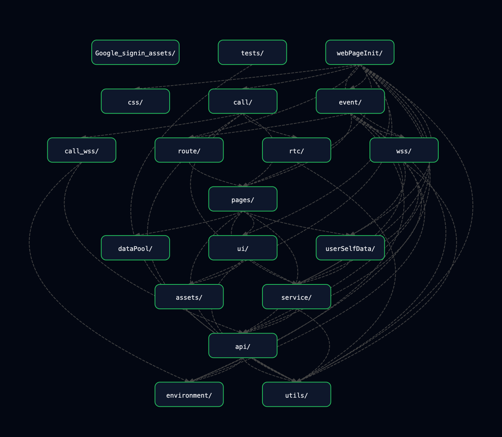
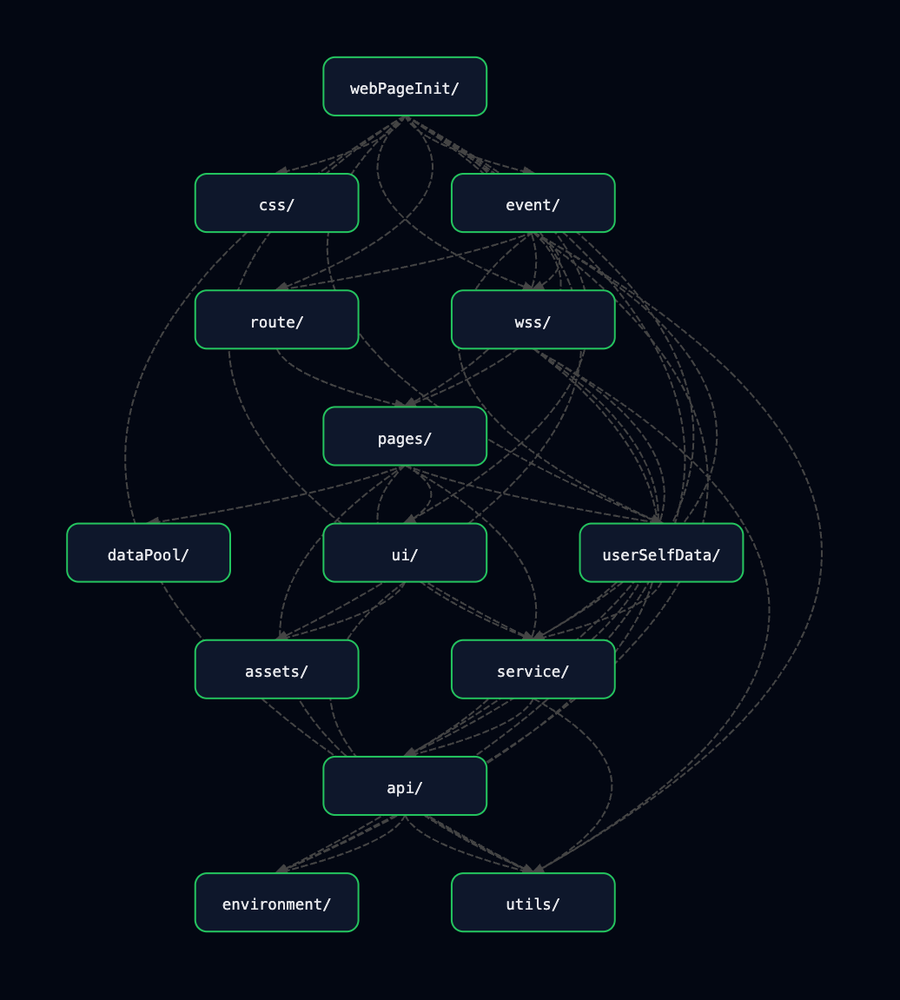
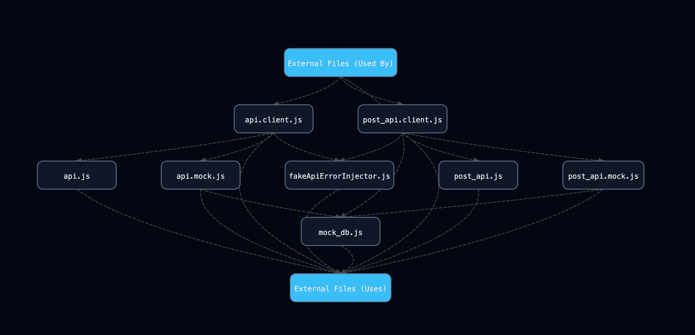
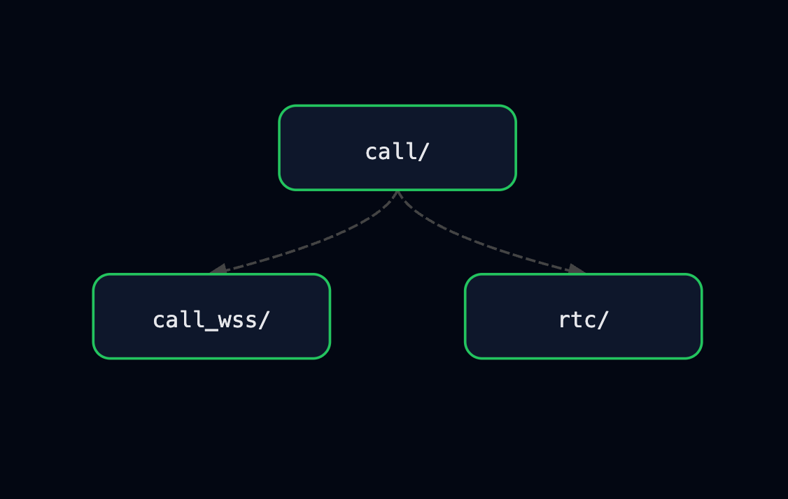
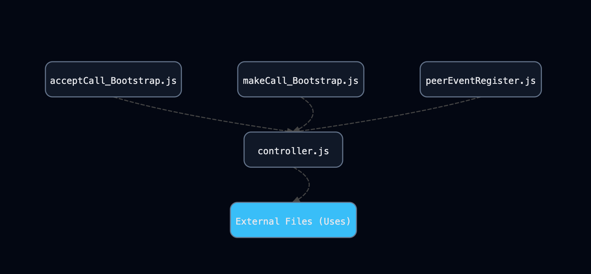

# Front-End System Overview

# 1. Introduction

Serendilang is a language exchange social platform that supports real-time video calls, text-based chat, post creation, likes, and friend connections.  
Any user on the platform can initiate a call with another user, which introduces additional security and safety considerations at the system design level.

At present, Serendilang is implemented as a web-based application.  
The system is designed with extensibility in mind and can be further extended to mobile applications in the future.

---

## 1.1 Platform Overview and Design Considerations

Due to the open nature of user-to-user communication, Serendilang incorporates reporting and blocking mechanisms for end users, as well as administrative controls that allow moderators to ban users or remove posts that violate community guidelines.

These requirements increase functional complexity in areas such as real-time communication, event handling, and state consistency.

---

## 1.2 System Complexity and Architectural Challenges

The front-end system of Serendilang currently consists of approximately 20,000 lines of source code, reflecting the complexity of its real-time communication features, and user-facing interactions.

Designing, maintaining, and preserving the scalability of such a system requires careful attention to system-level architecture, including clear separation of responsibilities, predictable execution flow, and long-term maintainability under continuous feature evolution.

---

## 1.3 Architectural Approach and Design Rationale

To address these challenges, the front-end system is built using **React**, along with **HTML**, **JavaScript (ES6 modules)**, and **TailwindCSS**, following a set of self-defined architectural conventions.

---

### Core Architectural Principles

#### 1.3.1 State Machine–Driven Architecture

The front-end system is modeled as a **state machine**, where state transitions are triggered by:

- **User interactions** (e.g., UI events)  
- **Server-side real-time updates** (e.g., WebSocket messages)  
- **Internal system events** (e.g., network errors during fetch) 

All state-changing events are unified and decoupled through a centralized event system: **`eventBus.js`**.


#### Centralized Event System (eventBus)

The implementation is as follows:

```javascript
const listeners = {}; 

export const eventBus = {
  on(event, callback) {
    if (!listeners[event]) listeners[event] = [];
    listeners[event].push(callback);
  },

  off(event, callback) {
    if (!listeners[event]) return;
    listeners[event] = listeners[event].filter(cb => cb !== callback);
  },

  emit(event, ...args) {   
    if (!listeners[event]) return;
    listeners[event].forEach(cb => cb(...args)); 
  }
};
```
During application initialization, all relevant events are registered and mapped to their corresponding handlers.

UI components are kept lightweight and decoupled—they only detect user interactions and emit events via `eventBus.emit(...)`, without directly handling business logic.

---

#### 1.3.2 Separation of System State and UI Rendering

To maintain a clear separation of concerns, the system adopts an architecture where **UI component hook parameters are treated as derived copies of a subset of the system state**, rather than the source of truth.

In this design, all UI-related state is maintained in a centralized system layer outside of React components.  
The hook parameters inside each UI component act only as **synchronized snapshots** of that state.

When the underlying system state changes, a dedicated update mechanism propagates those changes to the corresponding React components by updating their hook parameters, triggering re-rendering.

In other words, the UI does not own state—it simply reflects it:

**UI ≈ f(system state), where hook state is a synchronized replica, not the source of truth**

#### UI State Synchronization via Adapter

To bridge the system state and the UI layer, a dedicated adapter module, **`uiStateAdapter.js`**, is used.
The following are the two most important functions in `uiStateAdapter.js`:
```javascript
export function subscribe(id, handler) {
  if (!handlers.has(id)) {
    handlers.set(id, new Set());
  }
  handlers.get(id).add(handler);
  if (id in globalState) {
    handler(globalState[id]);
  }

  return () => {
    const set = handlers.get(id);
    if (!set) return;

    set.delete(handler);
    if (set.size === 0) {
      handlers.delete(id);
    }
  };
}

export function updateState(id, next) {
  const prev = globalState[id];
  const value =
    typeof next === 'function'
      ? next(prev)
      : next;

  globalState[id] = value;

  const set = handlers.get(id);
  if (set && set.size > 0) {
    for (const handler of set) {
      handler(value);
    }
  }
}
```

Every UI component (built with React) uses the following function defined in `StateViewBase.jsx`.  
This allows non-UI modules to directly update the component’s hook state by calling `updateState` from `uiStateAdapter.js`.

```javascript
import { subscribe, getState } from "../utils/uiStateAdapter.js";
import React, { useEffect, useMemo, useState } from "react";
import { ensureUiI18nRuntime } from "./i18n/uiI18nRuntime.js";

export function useSubscribedState(id, fallback = {}) {
  const [state, setState] = useState(() => getState(id) || fallback);

  useEffect(() => {
    ensureUiI18nRuntime();
  }, []);

  useEffect(() => {
    return subscribe(id, (next) => {
      setState(next || fallback);
    });
  }, [id]);

  return state;
}


```

---

## 2. Detailed Description

### 2.1 Overall Structure

All `.html` files for the application are centrally placed in the `webPages` directory.
The diagram below illustrates the complete `js/jsx` system that is utilized by `webPages`.Each `.html` file within `webPages` primarily relies on an entry `.js` file located in `webPagesInit`.  This entry file serves as the initialization point, responsible for bootstrapping the corresponding page and connecting it to the underlying system architecture.



In this diagram, each node represents a folder.

A directed edge from node A to node B indicates that **at least one file in folder A depends on a file in folder B**.
The graph is topologically sorted.  
Therefore, dependencies only flow downward — folders positioned lower in the diagram do not depend on those positioned above them.


---

## 2.2 Main Structure

This project includes voice and video call functionality.  
If we exclude the call-related components and focus only on the core modules involved in standard website operation, the subgraph derived from Figure 2.1 is shown below:





---

### 2.2.1 `webPageInit/`


This directory is responsible for **web page initialization**.  
It can be considered as the **entry point for each web page**.

Each file in this directory handles the setup logic required when a page is loaded.

---

### 2.2.2  **`event/`** 

This module embodies the core architectural rationale introduced in **Section 1.3.1**.

Its responsibilities include:

- provide functions for registering event handlers
- dispatching events through the global event bus (`utils/eventBus.js`)

**`eventEmitter.js`**

This file attaches a global event listener to the entire document.

Every UI component that can trigger an event includes a `dataset.actionList` property—an array of action objects describing:

- the action type  
- the event name  
- optional parameters  

When a user interacts with the page (click, scroll, input, etc.), the listener reads `actionList` and emits appropriate events through the event bus.

This creates a **declarative UI model** where components specify *what event should occur*, without knowing how it will be handled.


**`handlers/` Subfolder**

This subfolder contains all event handling modules.

Each handler:

1. imports the event bus  
2. registers callbacks for specific event names via the event bus (`utils/eventBus.js`, Layer 10)


This design keeps event emission and event handling cleanly separated.

---
### 2.2.3  **`route/`** 


for the main web page, there are a menu and pages, when user touches a menu button, the main screen switch to the page that it refers.
In this folder, it defines id of each page and the logics of entering and leaving a page.

---

### 2.2.4 **`wss/`** 


Serendilang is a real-time communication system. Users can exchange messages, send friend requests, receive notifications, and initiate voice or video calls.  
To support this, the UI must react to server-side events immediately and consistently across all active tabs.

The responsibility of this layer is to construct and manage the application's WebSocket object.  
All low-level WebSocket actions—such as connecting, sending messages, and handling incoming events—are defined within this layer.

**WebSocket Design Overview**

The WebSocket system implements a **shared connection architecture** to minimize unnecessary WebSocket connections to the server.

When a WebSocket object is created, it performs the following steps:

1. **Leader Detection**  
   - It checks `localStorage` and `BroadcastChannel` to determine if another tab has already established a WebSocket connection.  
   - If no active leader exists, the new object becomes the *leader* and opens the WebSocket connection to the server.

2. **Follower Mode**  
   - If a leader WebSocket object already exists, the new instance enters *follower mode*, meaning:
     - It does **not** open a WebSocket connection to the server.
     - It communicates with the leader through a `BroadcastChannel`.
     - The leader relays all messages to and from the server on behalf of all follower tabs.

3. **Message Routing**  
   - Messages produced by the application (e.g., sending chat messages, accepting friend requests, initiating calls) are dispatched through this layer’s WebSocket object.
   - In leader mode: messages are sent directly to the server.
   - In follower mode: messages are broadcast to the leader tab for forwarding.

4. **Server Event Distribution**  
   - When the server pushes an event over WebSocket, the leader broadcasts it to all follower instances using the same channel.
   - This ensures that every tab stays synchronized in real time.

**Implementation Structure**

The `wss/` folder contains three core modules, each responsible for a specific aspect of the shared WebSocket system:

- **`wssCenter.js`**  
  Serves as the central manager of the entire WebSocket system.

  This module maintains the global WebSocket abstraction, referred to as the *Virtual WSS*.  
  The Virtual WSS is not a native `WebSocket` instance created via `new WebSocket(url)`. Instead, it represents a unified logical WebSocket interface that may internally operate in either leader or follower mode.

  The Virtual WSS object is stored as a global variable within this module.  
  `wssCenter.js` is responsible for initializing the Virtual WSS, resetting or reinitializing it when necessary, and providing accessor functions to retrieve the current active instance.

  By centralizing WebSocket lifecycle management and global state in this module, the system ensures consistent behavior across all tabs while avoiding redundant WebSocket connections.


- **`createVirtualWss.js`**  
  Responsible for constructing the Virtual WebSocket abstraction (*Virtual WSS*).

  This module exposes the `createVirtualWss` factory function, which creates a unified WebSocket-like interface shared across browser tabs.  
  The returned object behaves similarly to a native `WebSocket` instance from the perspective of upper layers, while internally coordinating leader–follower roles and inter-tab communication.

  Upon creation, each Virtual WSS instance:
  - Generates a unique tab identifier.
  - Initializes a `BroadcastChannel` for cross-tab communication.
  - Checks persisted heartbeat information in `localStorage` to determine whether an existing leader is active.

  The module implements a **leader election mechanism** based on:
  - Periodic heartbeats stored in `localStorage`.
  - Cross-tab signaling via `BroadcastChannel`.
  - A lightweight lock mechanism to avoid race conditions during leader takeover.

  When operating in **leader mode**, the Virtual WSS:
  - Creates and maintains the real native `WebSocket` connection to the server.
  - Forwards incoming server messages to all follower tabs via `BroadcastChannel`.
  - Periodically emits heartbeat signals to indicate liveness.

  When operating in **follower mode**, the Virtual WSS:
  - Does not create a native `WebSocket` connection.
  - Relays outgoing messages to the leader via `BroadcastChannel`.
  - Receives server events indirectly from the leader and exposes them through the same WebSocket-like interface.

  This module also integrates with the event-driven system by emitting system-level events (e.g., WebSocket disconnection or leader failure) through the global event bus, allowing higher layers to react appropriately.

  By encapsulating leader election, heartbeat monitoring, and inter-tab coordination within this factory, `createVirtualWss.js` enables a scalable, resilient, and connection-efficient WebSocket architecture without exposing its internal complexity to the rest of the application.


- **`wssController.js`**  
  Provides the `sendWssMessage` and `setupWssHandlers` functions.

  The `sendWssMessage` function is responsible for sending messages through a given WebSocket abstraction (i.e., the Virtual WSS).  
  The `setupWssHandlers` function registers and binds WebSocket-related event handlers to the provided WebSocket instance, enabling the system to react to incoming messages and connection state changes.


Together, these modules separate connection management, coordination logic, and application-facing control flow, allowing the WebSocket system to remain modular, predictable, and scalable across multiple browser tabs.

---

**Benefits of This Architecture**

- **Only one WebSocket connection per user per browser**  
  Reduces server load and avoids duplicated connections.

- **Automatic multi-tab synchronization**  
  All tabs remain state-consistent without requiring polling or extra logic.

- **Centralized WebSocket logic**  
  Higher-level layers do not need to manage socket lifecycles—they simply call this layer’s methods.

- **Scalable for future features**  
  Works well for messaging, notifications, and voice/video call signaling.

---

### 2.2.5 **`pages/`** 

This module forms part of the core architectural rationale introduced in **Section 1.3.2**.

This module is responsible for managing all UI-related state and serves as the **single source of truth** for the front-end system.

It leverages the **UI State Synchronization via Adapter** mechanism introduced in **Section 1.3.2** to propagate state changes to the UI layer, ensuring that rendering remains a consistent and deterministic mapping from system state.


---

### 2.2.6 **`useSelfData/`** 

This module manages and provides access to data associated with the current user,  
acting as a centralized interface for user-specific state within the system.

---

### 2.2.7 **`dataPool/`** 

This module provides shared data sources that are accessed across different files within the `pages/` layer.

It serves as a centralized repository for cross-page or globally relevant data, such as the online user list, ensuring consistency and avoiding redundant state duplication.

---

### 2.2.8  **`ui/`** 

This module forms part of the core architectural rationale introduced in **Section 1.3.2**.

It contains pure React-based UI components that are solely responsible for rendering.  
These components do not handle business logic or state management, and instead rely on external state provided by the system.

---

### 2.2.9 **`service/`** 

This module provides functions for uploading and downloading data from the server.

It wraps the low-level API functions defined in `api/`, serving as an intermediary layer that:

- Handles errors and exceptions from API calls  
- Transforms server responses into application-level data structures  
- Preprocesses request payloads before sending them  

This design abstracts away raw API interactions, allowing higher-level modules to operate on clean and consistent data without depending on transport-level details.


---

### 2.2.10 **`api/`** 

This layer defines low-level API wrapper functions that directly communicate with server endpoints.

Each function in this layer corresponds to a **single HTTP request** and is responsible only for:
- constructing the request,
- sending it to the server,
- receiving and returning the response.

The entry points of this layer are `api.client.js` and `post_api.client.js`,  
which determine whether to use real API calls or mock implementations based on the environment configuration.

For development and testing, mock implementations are provided within this layer to simulate server behavior.  
The environment variable `VITE_APP_ENV` (configured via `fake_backend_env`) controls the switching logic:

- `test` → use mock functions (simulated server behavior)  
- otherwise → use real API calls to the backend  

This design enables **transparent switching** between real and simulated backends, allowing higher-level modules to remain unchanged across different environments.



As illustrated in the diagram, `api/` consists of:

- Two entry files: `api.client.js` and `post_api.client.js`, which control environment-based switching  
- Two modules for real API communication: `api.js` and `post_api.js`  
- Two mock API modules: `api.mock.js` and `post_api.mock.js`, which simulate server endpoints  
- A mock data layer (`mock_db.js`) that serves as an in-memory data source  

Currently, the API design supports only two HTTP methods: `GET` and `POST`.  
Modules prefixed with `api.` handle `GET` requests, while those prefixed with `post_api.` handle `POST` requests.


#### Error Handling
The `api.js` and `post_api.js` modules validate server responses to ensure they are successful and well-formed.  
If an abnormal or error response is detected, an exception is thrown.

This allows the `service/` (introduced in section 2.2.9) to handle errors in a context-aware manner.


---

### 2.2.11 **`utils/`** 


This folder provides shared utility tools that can be used across all layers of the application.

One of the most important components in this layer is the `eventBus`, which serves as the central
event-dispatching mechanism. All parts of the application emit events and register event handlers through the `eventBus`, enabling a consistent event-driven architecture.


In addition to infrastructure-level utilities, this layer also includes lightweight computational
helpers. For example, `calcOnlineUserScore.js` provides functions for calculating priority scores
used to rank online users.

---


# 3. Call Structure

# 3.1 Call Structure — Introduction

This project includes voice and video call functionality.  
This section focuses on the core modules involved in the call system.

The call feature consists of components responsible for signaling, media handling, and real-time communication between users.  
The subgraph derived from Figure 2.1 highlights the key modules that participate in establishing and maintaining a call session.



# 3.2 `call/` 

The `call/` folder contains the core orchestration logic of the call system, including the definition and management of the call lifecycle.  
Its main components are as follows:

- `controller.js`  
  The entire call is modeled as an object. This file defines the corresponding class and provides an initialization function that creates a call engine instance and assigns it to a global variable (`callEngine`).

  During the entire call lifecycle, only a single `callEngine` instance is created and maintained. This instance serves as the central coordinator of the call system, encapsulating multiple state variables and methods that are responsible for managing call states, handling events, and orchestrating the complete lifecycle of a call from initialization to termination.The methods provided by the `callEngine` include handling WebRTC and WebSocket reconnections, as well as managing camera activation and deactivation, allowing reconnection and media control logic to be centralized within the call engine. WebSocket event handlers (e.g., connection, message, error, and close events such as `socket.onopen`, `socket.onmessage`, and `socket.onclose`) are registered and managed within this file.


- `acceptCall_Bootstrap.js`  
  Contains the bootstrap logic for handling incoming calls.

- `makeCall_Bootstrap.js`  
  Contains the bootstrap logic for initiating outgoing calls.

- `peerEventRegister.js`  
  Responsible for registering peer-related events of the WebRTC peer connection during a call session.  
  The corresponding event handlers delegate event processing to the `callEngine` methods defined in `controller.js`.

The internal dependencies within this directory are illustrated in the figure below.



---

## 3.3 `call_wss/`

  Provides functions for creating and managing WebSocket connections, as well as sending signaling messages required during the call process.

## 3.4 `rtc/`

  Contains `core.js`, `domVideo.js`, and `initializePeer.js`.  
  This folder is responsible for all WebRTC-related functionality, including peer connection creation, media stream handling, DOM binding for video elements, and WebRTC event wiring.

  - `core.js`  
    Provides low-level, DOM-independent WebRTC primitives.  
    This file defines helper functions for creating and managing `RTCPeerConnection` instances, acquiring local media streams, generating and setting SDP offers and answers, applying remote descriptions and ICE candidates, and tearing down peer connections.  
    It focuses purely on WebRTC core logic without coupling to UI elements or DOM identifiers.

  - `domVideo.js`  
    Contains helper functions for binding media streams to DOM video elements.  
    This file is responsible for attaching and detaching local and remote media streams to corresponding video elements, handling safe playback, stopping and cleaning up existing streams, and managing basic UI-related behaviors such as visibility toggling and resize-triggered autoplay.  
    No WebRTC signaling or state management logic is implemented in this file.

  - `initializePeer.js`  
    Responsible for binding WebRTC peer connection events to the internal event-driven system.  
    This file registers event handlers on the `RTCPeerConnection` instance (e.g., track events, ICE candidate generation, ICE connection state changes, and general connection state changes) and propagates these events through `callEventBus`, allowing higher-level components (such as the call engine) to react to WebRTC state changes without directly depending on WebRTC APIs.


